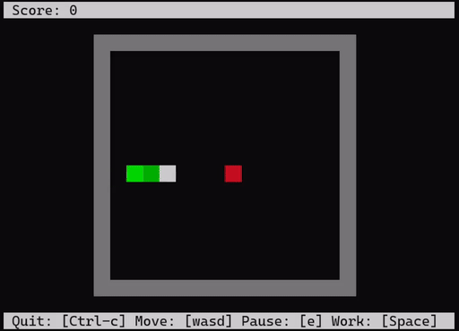

# Terminal Snake

```
Usage: terminal_snake [OPTIONS]...

Option        Long Option               Description
-h            --help                    Display this message
-s            --speed <speed>           Change the speed (default 100)
-b            --boundary <width,height> Change the boundary (default 16,16)
-k <keymap>   --keymap <keymap>         Choose the keymap (qwerty|azerty|dvorak)
-g <gradient> --gradient <gradient>     Choose the gradient
```
## Overview
C implementation of the Snake game genre in the terminal. Features different speeds, gradients, keymaps, and boundary sizes. Intended for and works best on Linux but also compiles on Windows with mingw-w64. Gradients to choose from are displayed in the help message from the executable. No libraries--everything is handled by ANSI escape codes. This decision was inspired by this [article](https://xn--rpa.cc/irl/term.html).

## Compilation & Running
### Linux
Compiled on WSL Ubuntu 24.04 with clang 18.1.3.
```
make
./build/terminal_snake
```
### Windows
Compiled with MSYS2 mingw-w64 clang version 20.1.8. Works best with the Microsoft Terminal.
```
make -f Makefile-windows
.\build-windows\terminal_snake.exe
```
